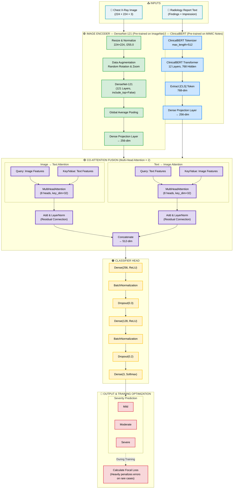

# CXR-MultiQuant — Model Architecture

This document outlines the complete multimodal deep learning architecture and data pipeline for the CXR-MultiQuant project.

## Complete Pipeline: Data Prep → Model Training → Severity Prediction

---

## Data Pipeline (Phase 1)

```mermaid
flowchart LR
    subgraph DATASOURCE["Hugging Face Hub"]
        HF["itsanmolgupta/mimic-cxr-dataset\n30,600 rows"]
    end

    subgraph COLUMNS["Raw Columns"]
        direction TB
        C1["image: Chest X-Ray (PIL Image)"]
        C2["findings: Doctor's detailed observations"]
        C3["impression: Doctor's final conclusion"]
    end

    subgraph LABELING["Severity Label Generation"]
        direction TB
        RULE["Rule-Based NLP\nKeyword Search on Impression"]
        S1["'severe' / 'extensive' / 'massive' → Severe"]
        S2["'moderate' / 'partial' → Moderate"]
        S3["Everything else → Mild"]
        RULE --> S1
        RULE --> S2
        RULE --> S3
    end

    subgraph FINAL["Final Dataset"]
        direction TB
        F1["Image (resized 224×224)"]
        F2["Text (Findings + Impression)"]
        F3["Label: Mild / Moderate / Severe"]
    end

    HF --> COLUMNS --> LABELING --> FINAL

    %% Soft Color Styling
    classDef dataStyle fill:#e8f4f8,stroke:#17a2b8,stroke-width:2px,color:#000;
    classDef processStyle fill:#d4edda,stroke:#28a745,stroke-width:2px,color:#000;
    classDef finalStyle fill:#e2d9f3,stroke:#6f42c1,stroke-width:2px,color:#000;

    class HF,C1,C2,C3 dataStyle;
    class RULE,S1,S2,S3 processStyle;
    class F1,F2,F3 finalStyle;
```

---

## Training Strategy

| Component | Detail |
|---|---|
| **Framework** | TensorFlow / Keras |
| **Image Encoder** | DenseNet-121 (with Random Rotation/Zoom Augmentation) |
| **Text Encoder** | ClinicalBERT (MIMIC pre-trained, fine-tuned) |
| **Fusion** | Co-Attention (2× Multi-Head Attention, 8 heads each) |
| **Pooling** | Global Average Pooling |
| **Loss Function** | Focal Loss (Addresses Class Imbalance) |
| **Train/Val/Test Split** | 80% / 10% / 10% (24,480 / 3,060 / 3,060) |
| **Evaluation Metrics** | Macro F1, AUC-ROC per class, Confusion Matrix |
| **Output** | SavedModel or .h5 file for FastAPI deployment |

---

## Hyperparameter Tuning (KerasTuner — Bayesian Optimization)

| Hyperparameter | Search Space |
|---|---|
| **Optimizer** | Adam, RMSprop |
| **Learning Rate** | 1e-3, 1e-4, 1e-5 |
| **Batch Size** | 8, 16, 32 |
| **Dropout Rate** | 0.2, 0.3, 0.5 |
| **Max Epochs per Trial** | Up to 30 (controlled by EarlyStopping) |
| **Max Trials** | 10–15 (Bayesian Optimization) |

### Callbacks (Active during every trial)

| Callback | Purpose |
|---|---|
| **EarlyStopping** | Monitors `val_loss`. Stops training if no improvement for 5 epochs. |
| **ModelCheckpoint** | Saves the best model weights from each trial automatically. |
| **ReduceLROnPlateau** | Reduces learning rate by 50% if `val_loss` plateaus for 3 epochs. |
