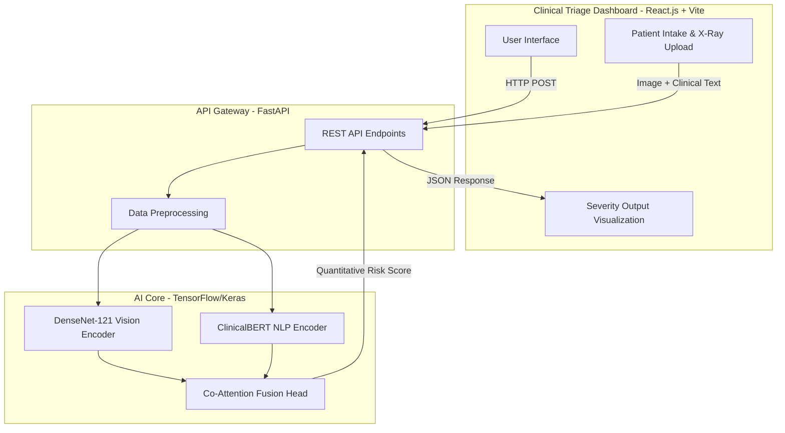

<div align="center">
  <h1>🩻 CXR-MultiQuant</h1>
  <p><strong>Enterprise-Grade Multimodal Deep Learning for Chest X-Ray Severity Quantification</strong></p>
</div>

---

## 🚀 Overview

**CXR-MultiQuant** is an enterprise-level, state-of-the-art (SOTA) multimodal deep learning system designed for modern clinical triage. It automates the quantification of disease severity from Chest X-Rays (CXRs) by simultaneously processing visual data (X-ray images) and clinical text (radiologist reports). 

Coupled with a sleek, high-performance React frontend and a lightning-fast FastAPI backend, it provides doctors with instant, expert-level diagnostic support inside a realistic Hospital EHR (Electronic Health Record) ecosystem.

## 🌐 Enterprise Full-Stack Architecture

CXR-MultiQuant is designed as a modern, decoupled web application. The frontend handles clinical data intake, the backend orchestrates the API traffic, and the deep learning core performs the heavy mathematical inference.



## 🛠️ Technology Stack

### 💻 Frontend (Client Layer)
*   **Framework:** React.js + Vite
*   **Styling:** Tailwind CSS
*   **Role:** A medical-grade, responsive EHR interface. Allows radiologists to drag-and-drop X-rays, paste clinical notes, and visualize the model's severity predictions in real-time.

### ⚙️ Backend (API Layer)
*   **Framework:** FastAPI (Python)
*   **Server:** Uvicorn
*   **Role:** Exposes high-performance REST endpoints (`/predict`). It receives `FormData` from the frontend, pre-processes images and text, invokes the Machine Learning model, and returns a JSON response.

### 🔬 Deep Learning (AI Core)
*   **Framework:** TensorFlow / Keras
*   **Vision Model:** DenseNet-121 (Pre-trained on ImageNet)
*   **NLP Model:** ClinicalBERT (Hugging Face)
*   **Role:** Fuses spatial image features with semantic text features using **Co-Attention Fusion** to provide a robust prediction of disease severity (Mild, Moderate, Severe).

## 🧠 Model Architecture (SOTA)

The core of CXR-MultiQuant is a custom-designed multimodal neural network optimized for medical vision-language tasks.

*   **Image Encoder:** Extracts robust 256-dim spatial representations using Global Average Pooling.
*   **Text Encoder:** Tokenizes and encodes "Findings" and "Impression" sections into 256-dim semantic embeddings.
*   **Co-Attention Fusion:** A dual Multi-Head Attention mechanism. This allows the model to "focus" on specific regions of the X-ray based on the clinical notes, and vice versa.
*   **Optimization:** Uses **Focal Loss** to explicitly handle severe class imbalance common in medical datasets.

For an in-depth breakdown of the neural network layers, tensors, and data pipeline, please refer to the detailed [ARCHITECTURE.md](./ARCHITECTURE.md).

## 📂 Repository Structure

```text
CXR-MultiQuant/
├── backend/               # FastAPI server, inference scripts, requirements.txt
├── frontend/              # Vite + React.js web application
├── notebooks/             # Exploratory Data Analysis & Model Prototyping
├── ARCHITECTURE.md        # Detailed DL architecture specification
├── LICENSE                # MIT License
└── README.md              # Project documentation
```

## 🚦 Getting Started

### Prerequisites
*   Python 3.9+
*   Node.js 18+ (for frontend)

### 1. Backend Setup
```bash
# Clone the repository
git clone <your-repo-url>
cd CXR-MultiQuant

# Setup Python virtual environment
python -m venv venv
source venv/bin/activate  # On Windows use: venv\Scripts\activate

# Install dependencies
pip install -r backend/requirements.txt

# Run the FastAPI server
cd backend
python main.py
```

### 2. Frontend Setup
```bash
# Open a new terminal tab
cd CXR-MultiQuant/frontend

# Install dependencies
npm install

# Start the development server
npm run dev
```

## 📊 Dataset & Pipeline
The model is trained on a curated subset of the **MIMIC-CXR dataset** (~30,600 rows). 
Severity labels are algorithmically generated using the CheXpert labeling approach, mapping 14 disease observations into a unified Risk Score (Mild, Moderate, Severe).
