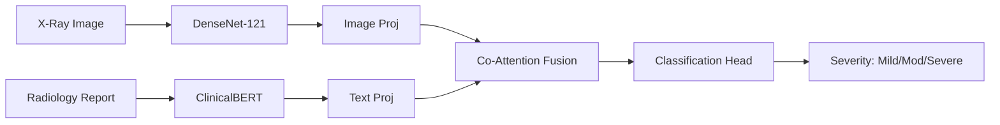

<div align="center">
  <h1>🩻 CXR-MultiQuant</h1>
  <p><strong>State-of-the-Art Multimodal Deep Learning for Chest X-Ray Severity Quantification</strong></p>
</div>

---

## 🚀 Overview

**CXR-MultiQuant** is a State-of-the-Art (SOTA) multimodal deep learning system designed to automate the quantification of disease severity from Chest X-Rays (CXRs). By simultaneously processing visual data (X-ray images) and clinical text (radiology reports), the system achieves expert-level diagnostic support. 

The architecture employs advanced **Co-Attention Fusion** to align spatial image features with semantic text features, providing a highly robust and interpretable prediction of disease severity (Mild, Moderate, Severe). 

## 🧠 Deep Learning Architecture (SOTA)

The core of CXR-MultiQuant is a custom-designed multimodal neural network optimized for medical vision-language tasks.

*   **Image Encoder (DenseNet-121):** Pre-trained on ImageNet and fine-tuned for radiographic feature extraction. Extracts robust 256-dim spatial representations using Global Average Pooling.
*   **Text Encoder (ClinicalBERT):** Pre-trained specifically on MIMIC clinical notes. Tokenizes and encodes "Findings" and "Impression" sections into 256-dim semantic embeddings.
*   **Co-Attention Fusion:** A dual Multi-Head Attention mechanism (Image → Text and Text → Image). This allows the model to "focus" on specific regions of the X-ray based on the clinical notes, and vice versa.
*   **Optimization:** Uses **Focal Loss** to explicitly handle severe class imbalance common in medical datasets, ensuring high sensitivity for rare, severe cases.

### Architecture Flow


For an in-depth breakdown of the layers, tensors, and data pipeline, please refer to the detailed [ARCHITECTURE.md](./ARCHITECTURE.md).

## 🛠️ Tech Stack

CXR-MultiQuant is structured as a modern, scalable full-stack application.

### 🔬 Deep Learning & AI
*   **Framework:** TensorFlow / Keras
*   **Vision Model:** DenseNet-121
*   **NLP Model:** ClinicalBERT (Hugging Face)
*   **Hyperparameter Tuning:** KerasTuner (Bayesian Optimization)

### ⚙️ Backend (API Layer)
*   **Framework:** FastAPI (Python)
*   **Inference:** TensorFlow Serving / ONNX Runtime
*   **Data Processing:** Pandas, NumPy, PIL
*   **Role:** Exposes high-performance REST endpoints for the frontend to submit images/text and receive real-time severity predictions.

### 💻 Frontend (User Interface)
*   **Framework:** React.js / Next.js *(In Development)*
*   **Styling:** Tailwind CSS + Framer Motion
*   **Role:** A sleek, medical-grade interface for radiologists to upload X-rays, paste clinical notes, and visualize the model's predictions and attention maps. 

## 📂 Repository Structure

```text
CXR-MultiQuant/
├── backend/               # FastAPI server, inference scripts, routing
├── frontend/              # Next.js/React web application (WIP)
├── notebooks/             # Exploratory Data Analysis & Model Prototyping
├── ARCHITECTURE.md        # Detailed DL architecture specification
├── LICENSE                # MIT License
└── README.md              # Project documentation
```

## 🚦 Getting Started

### Prerequisites
*   Python 3.9+
*   Node.js 18+ (for frontend)
*   CUDA Toolkit (for GPU acceleration)

### 1. Model & Backend Setup
```bash
# Clone the repository
git clone <your-repo-url>
cd CXR-MultiQuant

# Setup Python virtual environment
python -m venv venv
source venv/bin/activate  # On Windows use: venv\Scripts\activate

# Install dependencies
pip install -r backend/requirements.txt

# Run the FastAPI server
uvicorn backend.main:app --reload --port 8000
```

### 2. Frontend Setup (WIP)
```bash
cd frontend

# Install dependencies
npm install

# Start the development server
npm run dev
```

## 📊 Dataset & Pipeline
The model is trained on a curated subset of the **MIMIC-CXR dataset** (~30,600 rows). 
Severity labels are algorithmically generated using the CheXpert labeling approach, mapping 14 disease observations into a unified Risk Score (Mild, Moderate, Severe).
