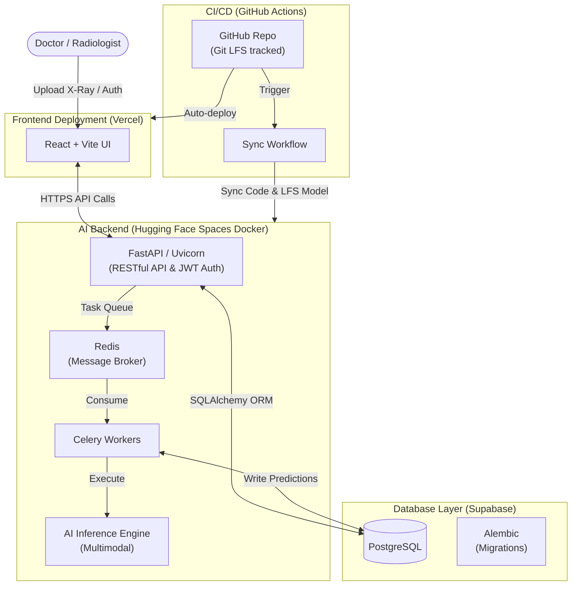

# 🫁 CXR-MultiQuant

[](https://cxr-multi-quant.vercel.app/)
[](https://huggingface.co/spaces/higgsboson1710/cxr-multiquant-backend)

**CXR-MultiQuant** is a full-stack, multimodal medical AI application built to assist radiologists with rapid triage. By fusing computer vision and NLP, it predicts the severity of patient conditions based on Chest X-Rays and clinical notes.

*For detailed information strictly regarding the Machine Learning models (DenseNet, ClinicalBERT, Focal Loss, etc.), please see [ARCHITECTURE.md](./ARCHITECTURE.md).*

---

## 🏗️ System Architecture

This project is engineered using a highly decoupled, modern microservice-style architecture to ensure scalable and secure inference.



## 🛠️ Technology Stack & Engineering Intricacies

### 1. Frontend Client
* **React & Vite:** Provides a blazing-fast, responsive Single Page Application (SPA).
* **Vercel:** Automates frontend deployments on every push to the `main` branch.

### 2. Backend & API
* **FastAPI:** A high-performance Python framework serving as the main REST API interface.
* **Security & Auth:** Stateless **JWT (JSON Web Tokens)** authentication. User passwords are cryptographically hashed via `passlib (bcrypt)`. FastAPI dependency injection (`Depends`) is used strictly to protect AI inference routes.
* **Celery & Redis:** Implemented for asynchronous background task processing, preventing heavy AI inference jobs from blocking the main API thread.

### 3. Database Layer
* **PostgreSQL (Supabase):** Cloud database instance connected via an IPv4 connection pooler to bypass Hugging Face networking limitations.
* **SQLAlchemy ORM:** Maps Python objects to database tables for secure, injection-free queries.
* **Alembic:** Handles automated database schema migrations, ensuring local and production environments remain perfectly synchronized.

### 4. CI/CD & Deployment
* **Hugging Face Spaces:** Houses the heavy backend Docker container (free 16GB RAM environment).
* **GitHub Actions:** A custom YAML workflow syncs code securely from GitHub to Hugging Face on every commit.
* **Git LFS (Large File Storage):** Used to bypass Git's 100MB limit, allowing the massive deep learning model to be securely version-controlled and deployed.

---

## 💻 Local Development

### Prerequisites
* Python 3.12+
* Node.js & npm
* PostgreSQL server (or cloud DB)
* Redis server (for Celery)

### Backend Setup
```bash
cd backend
python -m venv venv
source venv/bin/activate  # On Windows: venv\Scripts\activate
pip install -r requirements.txt

# Run migrations
alembic upgrade head

# Start Redis (in a separate terminal)
redis-server

# Start Celery Worker (in a separate terminal)
celery -A worker.celery worker --loglevel=info

# Start FastAPI server
uvicorn main:app --reload
```

### Frontend Setup
```bash
cd frontend
npm install
npm run dev
```
Navigate to `http://localhost:5173` in your browser.
