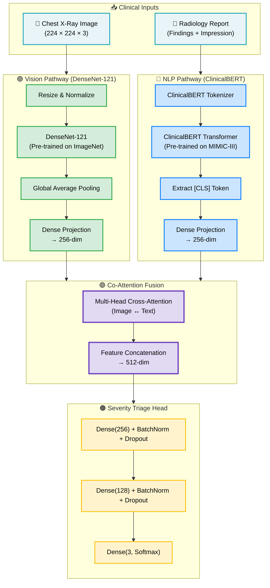

<div align="center">
  <h1>🫁 CXR-MultiQuant: Multimodal AI for Clinical Triage</h1>
  <p><strong>A Full-Stack Multimodal Deep Learning Application for Accelerated Radiology Triage</strong></p>

  [](https://cxr-multi-quant.vercel.app/)
  [](https://huggingface.co/spaces/higgsboson1710/cxr-multiquant-backend)
</div>

---

## 📖 Overview

**CXR-MultiQuant** is an advanced AI clinical decision support system designed to assist radiologists in rapidly triaging patients. It achieves this by fusing computer vision (analyzing Chest X-Rays) with Natural Language Processing (reading unstructured radiologist notes) to generate a unified severity prediction: **Mild, Moderate, or Severe**.

By combining both visual anomalies (e.g., opacities, consolidations) and semantic clinical context (e.g., patient history, nuanced findings), CXR-MultiQuant drastically reduces false positives and provides a holistic patient risk assessment.

---

## 🧠 Multimodal ML Architecture

Unlike standard single-modality clinical AIs, CXR-MultiQuant processes two independent data streams simultaneously using a **Co-Attention Fusion** mechanism.



### ML Pipeline Intricacies
* **Vision Encoder:** Utilizes a `DenseNet-121` backbone, heavily augmented with random rotations and zooms, to extract spatial features robust to patient positioning.
* **Text Encoder:** Employs `ClinicalBERT`, explicitly fine-tuned on clinical notes from the MIMIC-III database, to capture domain-specific medical semantics.
* **Loss Function:** Optimized using **Focal Loss** to penalize errors on minority (severe) cases, handling severe clinical class imbalances in the MIT MIMIC-CXR dataset.

---

## 🏗️ System Architecture & Backend Design

The system is built on a scalable, decoupled, modern tech stack designed for security and rapid AI inference.

### Tech Stack
* **Frontend:** React, Tailwind CSS, Vite (Glassmorphic UI deployed on **Vercel**)
* **Backend API:** FastAPI, Uvicorn, Python (RESTful architecture hosted on **Hugging Face Spaces Docker**)
* **Database:** PostgreSQL (Fully managed cloud instance via **Supabase**)
* **Deep Learning Framework:** TensorFlow 2, Keras, Hugging Face `transformers`
* **Authentication:** Stateless JWT (JSON Web Tokens) with `passlib` bcrypt hashing.

### Database & Authentication Flow
CXR-MultiQuant implements an enterprise-grade security layer for clinical data:
1. **User Registration:** Radiologists register via the `/auth/register` endpoint. Passwords are cryptographically salted and hashed using `bcrypt` before entering the PostgreSQL database.
2. **Stateless JWT Authorization:** Upon login, the backend issues an expiring JWT. The React frontend stores this and attaches it as a `Bearer` token to all subsequent API requests.
3. **Dependency Injection Security:** FastAPI's `Depends(get_current_user)` middleware guards all sensitive routes (like the AI `/predict` endpoint), ensuring only verified doctors can upload clinical data.
4. **Data Persistence:** Prediction results, alongside the doctor's ID and timestamps, are securely persisted in the Supabase PostgreSQL database using `SQLAlchemy` ORM models.

---

## 🚀 Deployment Automation (CI/CD)

The entire production lifecycle is automated via **GitHub Actions**:
1. **Frontend (Vercel):** Any push to the `main` branch automatically triggers Vercel to rebuild and redeploy the React interface.
2. **Backend (Hugging Face Spaces):** A custom `.github/workflows/sync_to_hub.yml` action securely authenticates with Hugging Face using repository secrets and forces a synchronized push.
3. **Dockerization:** Upon receiving the push, Hugging Face reads the root `Dockerfile`, isolates the `backend/` directory, installs `requirements.txt`, and boots the Uvicorn server on port `7860`.

---

## 💻 Local Development

### 1. Database Setup
Ensure you have a PostgreSQL instance running. Copy `backend/.env.example` to `backend/.env` and update `DATABASE_URL` with your connection string.

### 2. Start the Backend (FastAPI)
```bash
cd backend
python -m venv venv
source venv/bin/activate  # On Windows: venv\Scripts\activate
pip install -r requirements.txt

# Run Alembic migrations to build tables
alembic upgrade head

# Boot the server (Runs on port 8000)
uvicorn main:app --reload
```

### 3. Start the Frontend (React)
Open a separate terminal window:
```bash
cd frontend
npm install
npm run dev
```
Navigate to `http://localhost:5173` in your browser.
